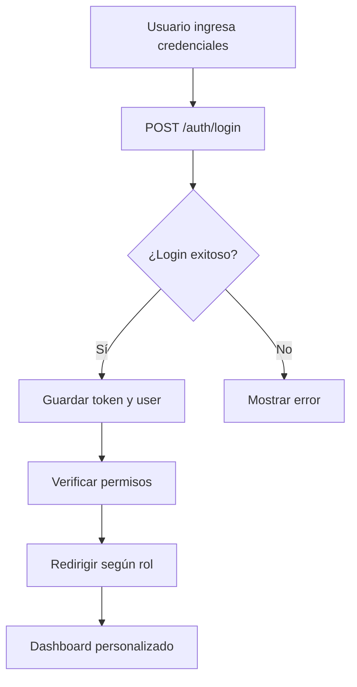
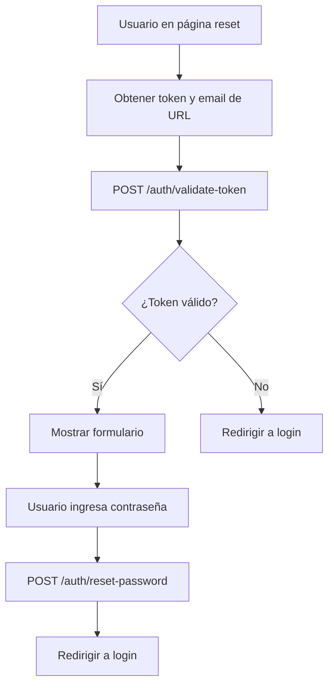
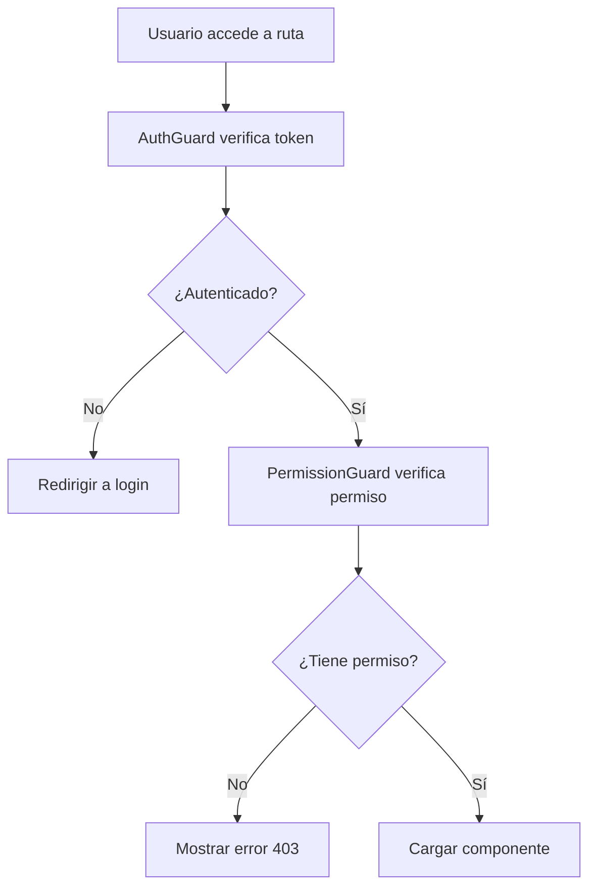

# 🔧 Guía Técnica de Integración Frontend

## 📋 Checklist de Implementación

### ✅ Configuración Inicial

1. **Interceptor HTTP**
   ```typescript
   // Implementar para agregar headers automáticamente
   Authorization: Bearer {token}
   Content-Type: application/json
   Accept: application/json
   ```

2. **Guard de Autenticación**
   ```typescript
   // Proteger rutas que requieren login
   canActivate: [AuthGuard]
   ```

3. **Guard de Permisos**
   ```typescript
   // Proteger rutas por permiso específico
   canActivate: [AuthGuard, PermissionGuard]
   data: { permission: 'Listar Usuarios' }
   ```

### ✅ Manejo de Tokens

1. **Almacenamiento**: localStorage
2. **Renovación**: Automática con refresh token
3. **Expiración**: Verificar antes de cada request

### ✅ Rutas Críticas

| Ruta Angular | API Endpoint | Permiso Requerido |
|-------------|--------------|-------------------|
| `/auth/reset-password` | `POST /auth/reset-password` | Público |
| `/users` | `GET /auth/users` | `Listar Usuarios` |
| `/clientes` | `GET /auth/clientes` | `Ver Clientes` |
| `/equipos` | `GET /auth/equipos` | `Listar Equipos` |
| `/reportes` | `GET /auth/reportes` | `Listar Reportes` |

---

## 🛡️ Matriz de Permisos por Rol

| Funcionalidad | Super-Admin | Administrador | Operador | Cliente |
|--------------|-------------|---------------|----------|---------|
| **Usuarios** |
| Crear | ✅ | ✅ | ❌ | ❌ |
| Editar | ✅ | ✅ | ❌ | ❌ |
| Listar | ✅ | ✅ | ✅ | ❌ |
| Eliminar | ✅ | ✅ | ❌ | ❌ |
| **Clientes** |
| Crear | ✅ | ✅ | ❌ | ❌ |
| Editar | ✅ | ✅ | ❌ | ❌ |
| Listar | ✅ | ✅ | ✅ | ❌ |
| Ver | ✅ | ✅ | ✅ | ✅ |
| Eliminar | ✅ | ✅ | ❌ | ❌ |
| **Sedes** |
| Crear | ✅ | ✅ | ❌ | ❌ |
| Editar | ✅ | ✅ | ❌ | ❌ |
| Listar | ✅ | ✅ | ✅ | ✅ |
| Eliminar | ✅ | ✅ | ❌ | ❌ |
| **Equipos** |
| Crear | ✅ | ✅ | ✅ | ❌ |
| Editar | ✅ | ✅ | ✅ | ❌ |
| Listar | ✅ | ✅ | ✅ | ✅ |
| Eliminar | ✅ | ✅ | ❌ | ❌ |
| **Reportes** |
| Crear | ✅ | ❌ | ✅ | ❌ |
| Firmar | ✅ | ❌ | ✅ | ❌ |
| Listar | ✅ | ✅ | ✅ | ✅ |
| Imprimir | ✅ | ✅ | ✅ | ✅ |
| **Hoja de Vida** |
| Crear | ✅ | ❌ | ✅ | ❌ |
| Ver | ✅ | ✅ | ✅ | ✅ |
| Imprimir | ✅ | ✅ | ✅ | ✅ |
| **Roles** |
| Gestionar | ✅ | ❌ | ❌ | ❌ |

---

## 🔄 Flujos de Trabajo Recomendados

### 1. Login y Navegación


### 2. Recuperación de Contraseña


### 3. Protección de Rutas


---

## 🎯 Componentes Clave a Implementar

### 1. AuthService
**Responsabilidades:**
- Gestión de tokens
- Login/logout
- Verificación de permisos
- Refresh automático

### 2. PermissionDirective
```typescript
*appHasPermission="'Crear Usuarios'"
```

### 3. RoleDirective
```typescript
*appHasRole="'Super-Admin'"
```

### 4. Error Interceptor
```typescript
// Manejar errores 401, 403, 422
```

### 5. Loading Interceptor
```typescript
// Mostrar spinner durante requests
```

---

## 📦 Estructura de Servicios Recomendada

```
src/app/
├── core/
│   ├── guards/
│   │   ├── auth.guard.ts
│   │   └── permission.guard.ts
│   ├── interceptors/
│   │   ├── auth.interceptor.ts
│   │   ├── error.interceptor.ts
│   │   └── loading.interceptor.ts
│   ├── services/
│   │   ├── auth.service.ts
│   │   ├── user.service.ts
│   │   ├── cliente.service.ts
│   │   ├── equipo.service.ts
│   │   └── reporte.service.ts
│   └── directives/
│       ├── has-permission.directive.ts
│       └── has-role.directive.ts
├── features/
│   ├── auth/
│   │   ├── login/
│   │   └── reset-password/
│   ├── users/
│   ├── clientes/
│   ├── equipos/
│   └── reportes/
└── shared/
    ├── components/
    ├── pipes/
    └── models/
```

---

## 🔍 Tipos TypeScript Recomendados

```typescript
// models/auth.model.ts
export interface LoginCredentials {
  email: string;
  password: string;
}

export interface AuthResponse {
  access_token: string;
  token_type: string;
  expires_in: number;
  user: User;
}

export interface User {
  id: number;
  name: string;
  email: string;
  empresa_id: number;
  created_at: string;
  updated_at: string;
  empresa: Empresa;
  roles: Role[];
  permissions: string[];
}

export interface Role {
  id: number;
  name: string;
  guard_name: string;
}

export interface Empresa {
  id: number;
  nombre: string;
  nit: string;
  // ... otros campos
}

// models/cliente.model.ts
export interface Cliente {
  id: number;
  nombre: string;
  nit: string;
  telefono?: string;
  email?: string;
  direccion?: string;
  departamento_id: number;
  municipio_id: number;
  created_at: string;
  updated_at: string;
}

// models/equipo.model.ts
export interface Equipo {
  id: number;
  serie: string;
  marca: string;
  modelo: string;
  sede_id: number;
  tipo_equipo_id: number;
  created_at: string;
  updated_at: string;
}

// models/api-response.model.ts
export interface ApiResponse<T> {
  data: T;
  message?: string;
}

export interface PaginatedResponse<T> extends ApiResponse<T[]> {
  meta: {
    current_page: number;
    last_page: number;
    per_page: number;
    total: number;
  };
}

export interface ApiError {
  message: string;
  errors?: {
    [field: string]: string[];
  };
}
```

---

## ⚡ Optimizaciones y Mejores Prácticas

### 1. Lazy Loading
```typescript
// Cargar módulos bajo demanda
const routes: Routes = [
  {
    path: 'users',
    loadChildren: () => import('./features/users/users.module').then(m => m.UsersModule),
    canActivate: [AuthGuard, PermissionGuard],
    data: { permission: 'Listar Usuarios' }
  }
];
```

### 2. Caché de Datos
```typescript
// Implementar caché para listas estáticas
@Injectable()
export class CacheService {
  private cache = new Map<string, any>();
  
  get(key: string) {
    return this.cache.get(key);
  }
  
  set(key: string, data: any) {
    this.cache.set(key, data);
  }
}
```

### 3. Estado Global
```typescript
// Usar NgRx o Akita para estado compartido
interface AppState {
  auth: AuthState;
  users: UsersState;
  clientes: ClientesState;
}
```

### 4. Validaciones Reactivas
```typescript
// Formularios con validaciones consistentes
this.userForm = this.fb.group({
  name: ['', [Validators.required, Validators.minLength(2)]],
  email: ['', [Validators.required, Validators.email]],
  password: ['', [Validators.required, Validators.minLength(8)]]
});
```

---

## 🚨 Errores Comunes y Soluciones

### 1. Token Expirado
**Error:** 401 Unauthorized  
**Solución:** Implementar refresh automático

### 2. Permisos Insuficientes
**Error:** 403 Forbidden  
**Solución:** Verificar permisos antes de mostrar opciones

### 3. Rate Limiting
**Error:** 429 Too Many Requests  
**Solución:** Implementar retry con backoff

### 4. CORS
**Error:** Access-Control-Allow-Origin  
**Solución:** Verificar configuración del backend

---

## 📈 Métricas y Monitoreo

### KPIs a Monitorear
1. **Tiempo de respuesta** de APIs
2. **Tasa de errores** por endpoint
3. **Uso de permisos** por usuario
4. **Sesiones activas** simultáneas

### Logging Recomendado
```typescript
// Logs estructurados
console.log({
  action: 'USER_LOGIN',
  user_id: user.id,
  timestamp: new Date().toISOString(),
  success: true
});
```

---

## 🔄 Versionado de API

### Headers de Versión
```typescript
headers: {
  'Accept': 'application/json',
  'API-Version': 'v1'
}
```

### Compatibilidad Hacia Atrás
- Mantener endpoints deprecated
- Notificar cambios con anticipación
- Documentar breaking changes

---

**Última actualización:** 2 de noviembre de 2025  
**Versión del documento:** 1.0
