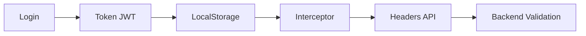

# 📚 Documentación para Frontend - CST API

## 📋 Archivos de Documentación

Este proyecto incluye documentación completa para la integración del frontend Angular con la API Laravel:

### 📖 1. DOCUMENTACION_FRONTEND_API.md
**Documentación completa y detallada**
- Todos los endpoints disponibles
- Ejemplos de request/response
- Códigos de implementación en Angular
- Manejo de errores y seguridad
- Guards, interceptors y servicios

### 🔧 2. GUIA_TECNICA_FRONTEND.md
**Guía técnica especializada**
- Checklist de implementación
- Matriz de permisos por rol
- Flujos de trabajo recomendados
- Estructura de proyecto Angular
- Tipos TypeScript
- Mejores prácticas y optimizaciones

### 📄 3. api-specification.json
**Especificación técnica en JSON**
- Definición exacta de todos los endpoints
- Parámetros y respuestas estructuradas
- Permisos y roles detallados
- Rate limits y configuraciones de seguridad

---

## 🚀 Inicio Rápido

### 1. Configuración Base
```typescript
// environment.ts
export const environment = {
  production: false,
  apiUrl: 'http://localhost:8000/api',
  frontendUrl: 'http://localhost:4200'
};
```

### 2. Instalación de Dependencias
```bash
npm install @angular/common @angular/router
```

### 3. Implementación Mínima
1. Crear `AuthService` con login/logout
2. Implementar `AuthGuard` para proteger rutas
3. Crear `AuthInterceptor` para headers automáticos
4. Configurar `PermissionGuard` para roles

---

## 🔐 Flujo de Autenticación



---

## 🛡️ Roles y Permisos

| Rol | Usuarios | Clientes | Equipos | Reportes |
|-----|----------|----------|---------|----------|
| **Super-Admin** | ✅ Todos | ✅ Todos | ✅ Todos | ✅ Todos |
| **Administrador** | ✅ CRUD | ✅ CRUD | ✅ CRUD | 👁️ Solo ver |
| **Operador** | 👁️ Solo ver | 👁️ Solo ver | ✅ CRUD | ✅ CRUD |
| **Cliente** | ❌ | 👁️ Solo propios | 👁️ Solo propios | 👁️ Solo propios |

---

## 📞 Endpoints Críticos

### Autenticación
- `POST /auth/login` - Login principal
- `POST /auth/logout` - Cerrar sesión
- `POST /auth/refresh` - Renovar token
- `POST /auth/me` - Información del usuario

### Recuperación de Contraseña
- `POST /auth/forgot-password` - Solicitar recuperación
- `POST /auth/validate-token` - Validar token
- `POST /auth/reset-password` - Cambiar contraseña

### Gestión Principal
- `GET /auth/users` - Lista de usuarios
- `GET /auth/clientes` - Lista de clientes
- `GET /auth/equipos` - Lista de equipos
- `GET /auth/reportes` - Lista de reportes

---

## ⚠️ Consideraciones Importantes

### Seguridad
- **Rate Limiting**: Login 10/min, Reset 5/min
- **Anti-enumeration**: Respuestas genéricas en recuperación
- **CORS**: Configurado para desarrollo
- **JWT**: Tokens con expiración

### Permisos
- Verificar permisos antes de mostrar opciones
- Usar guards en todas las rutas protegidas
- Implementar directivas `*hasPermission` y `*hasRole`

### Errores Comunes
- 401: Token expirado → Refresh automático
- 403: Sin permisos → Ocultar opciones
- 422: Validación → Mostrar errores específicos
- 429: Rate limit → Implementar retry con delay

---

## 🔧 Configuración de Desarrollo

### Variables de Entorno (.env)
```bash
# Backend Laravel
APP_URL=http://localhost:8000
APP_FRONTEND_URL=http://localhost:4200

# Frontend Angular
API_URL=http://localhost:8000/api
```

### Puertos por Defecto
- **Frontend Angular**: http://localhost:4200
- **Backend Laravel**: http://localhost:8000
- **Mailpit (emails)**: http://localhost:1025

---

## 📋 Checklist de Implementación

### ✅ Fase 1: Autenticación Básica
- [ ] AuthService con login/logout
- [ ] LocalStorage para tokens
- [ ] AuthGuard para rutas protegidas
- [ ] AuthInterceptor para headers

### ✅ Fase 2: Permisos y Roles
- [ ] PermissionGuard
- [ ] Directivas hasPermission/hasRole
- [ ] Menús dinámicos según permisos
- [ ] Validación de acceso a componentes

### ✅ Fase 3: Funcionalidades
- [ ] Reset de contraseña
- [ ] CRUD de usuarios
- [ ] CRUD de clientes
- [ ] CRUD de equipos
- [ ] CRUD de reportes

### ✅ Fase 4: Optimización
- [ ] Lazy loading de módulos
- [ ] Caché de datos estáticos
- [ ] Manejo de errores global
- [ ] Loading states
- [ ] Refresh automático de tokens

---

## 📞 Soporte Técnico

Para dudas específicas sobre implementación:

1. **Consultar documentos**:
   - `DOCUMENTACION_FRONTEND_API.md` para ejemplos completos
   - `GUIA_TECNICA_FRONTEND.md` para mejores prácticas
   - `api-specification.json` para referencia técnica

2. **Revisar implementación**:
   - Verificar headers y autenticación
   - Validar permisos y roles
   - Confirmar endpoints y parámetros

3. **Testing**:
   - Probar con Postman o similar
   - Verificar respuestas en DevTools
   - Comprobar flujo completo

---

**Fecha de creación:** 2 de noviembre de 2025  
**Versión:** 1.0  
**Estado:** Documentación completa y lista para implementación
